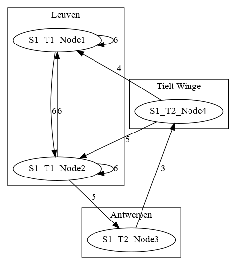

Demo application
================

This repository contains a very simple demo application that can be used to model complex distributed applications.
Each instance of the application can be given a site, tier, name and location. Each application listens for others application 
instances. The `connects_to` config setting contains a list of other instances to connect to.

The application gossips the topology of the complete setup, including latencies over each link. Based on this topology
a graph is rendered and available on the application.

For example, 4 instances that each using the config1-4.toml files in this repo, the following graph is created:

  
 

The application uses python 3.6 or python 3.7 and the python libraries listed in requirements.txt Additionally the 
application requires `dot` which is commonly provided with the graphviz package.

Running tests
-------------

The application has a basic set of unit tests. These tests can be executed with pytest. The correct procedure to run
these tests is:

```bash
    $ install graphviz
    $ pip install -U -r requirements.txt
    $ pip install .
    $ pytest -vvv tests
```